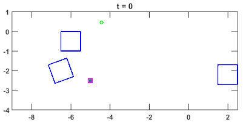

title: ACC2017: Computation of forward stochastic reach sets: Application to dynamic obstacle avoidance
Date:2017-02-08
tags: My Research, Stochastic Reachability, Obstacle Avoidance, Model Predictive Control
category: Control theory
author: Abraham Vinod
summary: Summary of the ACC 2017 paper
URL: acc2017.html
save_as: acc2017.html

 
 
This blog post will summarize my paper **Computation of forward stochastic
reach sets: Application to stochastic, dynamic obstacle avoidance** accepted
for publication at American Control Conference (ACC), 2017. The conference will
    happen on May 24-26, 2017 at Seattle, WA, USA. This work was done in
    collaboration with [Dr. Baisravan
    HomChaudhuri](http://www.cs.unm.edu/amprg/People/baisravan/) and [Prof.
    Meeko Oishi](http://www.unm.edu/~oishi).

# What is this paper about?

## High-level description

The next five years looks poised to make autonomous transportation a reality
--- both in our cities[^selfdriving] and in our oceans[^selfship], and
researchers around the world are looking at different aspects of autonomous
transportations. A major component of autonomous transportation is avoiding
obstacles, which in itself, is a complex task involving sensing, planning, and
execution. This paper focuses on the planning component.

Imagine the scenario where a self-driving car is attempting to avoid hitting a
pedestrian[^Chris].  Clearly, it is impossible to predict exactly what the
pedestrian is going to do at any given time making this problem really hard.
While most of the software and algorithms are proprietary, the approach taken
by the industry has been to use several of the available well-tested software
and hardware solutions, put them together, and tune/train learning algorithms
to perform in a desired manner[^MUO].  However, this approach lacks the
guarantee of safety, something that would be crucial for making the dream of
autonomous transportation a reality[^NYT].

We believe control theory can be leveraged to provide the required guarantees
of safety.  We account for the pedestrian's action into the model as a
disturbance. There are two approaches in control to provide safety guarantees
in the presence of disturbance:

1. **Absolute guarantee**: a conservative approach where the control
actions are designed by treating the disturbance as an adversary, and
1. **Probabilistic guarantee**: a stochastic approach where the control actions
are designed by respecting the likelihood of the disturbance taking different
actions.

Both of these approaches have their pros and cons. Due to the absolute safety
requirement, the conservative approaches may fail in complex environments.  The
stochastic approach can find control actions even in complex environments but
requires additional information (likelihoods of the disturbance taking
different actions). Nevertheless, both of these approaches can be used to
design the control actions that needs to be taken to ensure that the desired
safety levels are achieved. 

If you like to skip the technical details, you may directly
move on to the [section](#application) where we compare how using the stochastic
approach a robot avoids all the obstacles, and successfully reaches a goal state.

## A more technical description

In this paper, we consider uncontrolled discrete-time nonlinear systems perturbed by
an affine discrete disturbance[^systems]. We assume that the disturbance has a
finite support, and its stochastics (probability mass function) is known.  We
are interested in performing the **forward stochastic reachability analysis**,
that is, characterize the stochasticity of the state of a system at some point
of time in future when the system is initialized at a known initial condition.
For any given point of time in future, we propose an **iterative formulation**
for computing:

1. forward stochastic reach set (FSR set) --- the states which the system can
reach with non-zero likelihood.
1. forward stochastic reach probability measure  (FSRPM) --- the probability
mass function associated with the state, a discrete random vector.

We utilize the forward reachability analysis to avoid rigid body obstacles in a
stochastic environment via an **occupancy function**. The occupancy function
provides the probability of finding an obstacle at a given point in the state
space. We show that to achieve a desired probabilistic safety, avoiding a
corresponding super-level set of the occupancy function is sufficient. We also
analyze the convexity properties of the occupancy function, and these results
ensure that the obstacle avoidance problem can be solved very efficiently. We
leverage existing work on avoiding dynamic obstacles using a mixed-integer
programming framework[^IP].

# What is so great about this paper?

1. **Decoupled analysis** for forward stochastic reachability analysis: The
proposed iterative formulation allows for leveraging existing tools for
deterministic reachability analysis.
1. **Occupancy function**: We define the occupancy function using forward
reachability analysis and analyze its convexity properties.  
1. **Stochastically moving obstacle avoidance** using occupancy function: We
demonstrate the utility of the occupancy function in formulating a convex
optimization problem for obstacle avoidance.  
1. **Comparison of the conservative and the stochastic approaches** for
obstacle avoidance problems: We discuss how the stochastic approach prevails in
complex situations where more information is available.

# Can you give me an example of the application of this method?

We now consider the specific problem of robot navigation in an environment with
rigid body obstacles moving in straight lines with stochastic velocities. 

## Relating this problem to the high-level description

The robot here can be thought of as the self-driving car, and the rigid body
obstacles as the pedestrians with their associated 'safety bubbles'.

## What is the information provided for this problem?

1. the initial position of the robots R and the obstacles,
1. the goal position for the robot R,
1. the desired guarantee of probabilistic safety,
1. the deterministic LTI dynamics of the robot R,
1. the disturbed (stochastic) LTI dynamics of the obstacles, and
1. the probability mass function of the stochastic velocities of the obstacles.

## What should be computed for this problem?

We would like to drive the robot R to the desired goal in finite time while
ensuring a probabilistic guarantee of safety. We compute a receding horizon
controller input sequence that achieves the desired result.

## Results

We consider the control strategies given by both the approaches for robot R.
The **red robot** seeks a *probabilistic guarantee* of safety, and the **pink
robot** seeks an *absolute guarantee* of safety.  The red and pink robots are
assumed to have point mass dynamics discretized in time with bounded control
authority forcing it to always move forward in the $y$-direction. The obstacles
are constrained to move in straight lines. 

    

    

        
    

Snapshots[^GIF] of the environment with the robot R controlled using different
approaches: 

* The goal position for the robots is denoted by green circle,
* The red robot's trajectory is indicated by the blue line, 
* The pink robot's trajectory is indicated by the cyan line, and
* The blue boxes indicate the obstacles.

While the simulation (shown above) is just a single trial, the red robot can also
collide with the obstacles in some of the trials due to the stochasticity in the
environment.  However, in an experiment involving a fixed number of trials, the
average number of trials ending in a collision is guaranteed to be less than a
given threshold as desired.

# Where do I get more details?
* Paper is available on [Arxiv](https://arxiv.org/abs/1610.03472v1).  
* Project details can be found at my [academic website](http://unm.edu/~abyvinod/projects.html#reach).
<!--* MATLAB code for generating these figures can be downloaded from
[here](http://unm.edu/~abyvinod/files/HSCC2017.zip).-->

[^selfdriving]: [http://spectrum.ieee.org/transportation/advanced-cars/2017-the-year-of-selfdriving-cars-and-trucks](http://spectrum.ieee.org/transportation/advanced-cars/2017-the-year-of-selfdriving-cars-and-trucks)
[^selfship]: [http://spectrum.ieee.org/transportation/marine/forget-autonomous-cars-autonomous-ships-are-almost-here](http://spectrum.ieee.org/transportation/marine/forget-autonomous-cars-autonomous-ships-are-almost-here)
[^Chris]: Chris Urmson, the former CTO of Google's self-driving car project
(now Waymo), talks about this in a TED talk
[https://www.youtube.com/watch?v=tiwVMrTLUWg&feature=youtu.be&t=7m11s](https://www.youtube.com/watch?v=tiwVMrTLUWg&feature=youtu.be&t=7m11s)
[^MUO]: [http://www.makeuseof.com/tag/how-self-driving-cars-work-the-nuts-and-bolts-behind-googles-autonomous-car-program/](http://www.makeuseof.com/tag/how-self-driving-cars-work-the-nuts-and-bolts-behind-googles-autonomous-car-program/)
[^NYT]: [https://www.nytimes.com/interactive/2016/12/14/technology/how-self-driving-cars-work.html?_r=0](https://www.nytimes.com/interactive/2016/12/14/technology/how-self-driving-cars-work.html?_r=0)
[^systems]: This class of systems includes affine noise perturbed LTI
discrete-time systems with known state feedback. The work is also applicable to
affine noise perturbed LTI discrete-time systems with open loop controllers
after some minor modifications.
[^dist]: The disturbance is assumed to be an IID random process, but we can
relax the identical assumption if needed.
[^IP]: [Tom Schouwenaars, Jonathan How, and Eric Feron. "Receding horizon path planning with implicit safety guarantees." In *American Control Conference*, vol. 6, pp. 5576-5581. IEEE, 2004.](http://ieeexplore.ieee.org/abstract/document/1384742/).
[^GIF]: The GIFs were created using [http://gifcreator.me/](http://gifcreator.me/) and [http://resizeimage.net/](http://resizeimage.net/).
