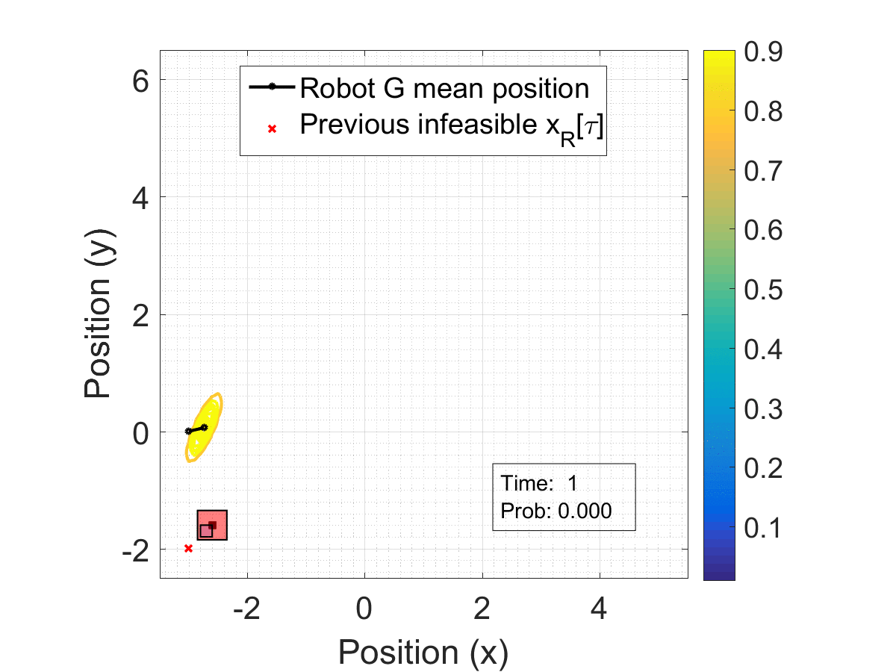

title: HSCC2017: Forward Stochastic Reachability Analysis for Uncontrolled Linear Systems using Fourier Transforms
Date:2017-02-03
tags: My Research, Stochastic Reachability, Convex Optimization
category: Control theory
author: Abraham Vinod
summary: Summary of the HSCC 2017 paper
URL: hscc2017.html
save_as: hscc2017.html

 
 
This blog post will summarize my paper **Forward Stochastic Reachability
Analysis for Uncontrolled Linear Systems using Fourier Transforms** published at
Hybrid Systems: Computation and Control 2017. The conference will happen on
April 18-20th, 2017 at Pittsburg, PA, USA.

# What is this paper about?

## High-level description

Imagine we have a boat facing a crisis drifting in the ocean. Let us say we have a model
of the ocean current. This model will help us predict *exactly* where the boat will drift
to if the only force acting on it is the ocean current. However, we know that
the boat can be subjected to our forces like wind, waves which will be pretty
difficult to model. We account for these forces in form of a disturbance to our
model, and this disturbance will *corrupt* our predictions. Assuming we have
some information about the likelihood of the disturbance's actions, a
natural question to ask is --- **can we predict with some likelihood where the
boat will drift to and what is the smallest set that covers all possible locations where
the boat can drift to?** Answering this question can help a rescuer ship, say
the coast guard, act swiftly and increase the likelihood of success when
searching a vast ocean for the boat. This paper provides a mathematical
structure to this problem and proposes an efficient way to compute the
likelihood as well as the set. If you like to skip the technical details, you
may directly move on to the [section](#application) where we apply this work on
rescuing the boat.

## A more technical description

We look at discrete-time uncontrolled linear systems[^systems] perturbed by a
disturbance[^dist] whose stochastics (say probability density function) is known. We
are interested in performing the **forward stochastic reachability analysis**, that
is, characterize the stochasticity of the state of a system at some point of
time in future when the system is initialized at a known initial condition.  For
any given point of time in future, we propose an **analytical formulation**
for computing via Fourier transforms:

1. forward stochastic reach set (FSR set) --- the smallest closed subset of the state
space that occurs almost surely.
1. forward stochastic reach probability density  (FSRPD) --- the probability density
associated with the state, an absolutely continuous random vector.

Moreover, we provide sufficient conditions for FSRPD to be **logconcave**.
Logconcavity ensures that **convexity** of the constraints and objective
functions created using forward stochastic reachability analysis. Convex
optimization problems are sought after since they are tractable and can
generally be solved very efficiently.

We discuss one application of this analysis --- maximizing the probability of
capture of a non-adversarial uncontrolled target (with stochastic dynamics) by a
controlled robot (with deterministic dynamics).

# What is so great about this work?

1. **Not a Eulerian method (not a grid-based method)**: This implies that we
can mitigate the [curse of
dimensionality](https://en.wikipedia.org/wiki/Curse_of_dimensionality). Existing
approaches of performing forward stochastic reachability analysis are through
dynamic programming[^SummersAutomatica2010] and inverted dynamics. Dynamic
programming can not be applied to dimensions higher than 5.
1. Can handle **unbounded stochastic disturbances** and is **not restricted to
Gaussians**: We demonstrate our method to an exponential disturbance as
well.
1. **Sufficient conditions for the convexity** of the FSR set and the FSRPD
provided
1. **Convex optimization formulation** for non-adversarial stochastically moving
target problem
1. **Applications**: Usefulness demonstrated for stochastic motion planning
problems. We also anticipate the application of this method in obstacle avoidance,
aircraft trajectory planning, and other venues.

# Can you give me an example for application of this method?

In this paper, we analyze the problem of capture of a non-adversarial target
(robot G) with stochastic dynamics using a robot (robot R) with deterministic
dynamics. 

## Relating this problem to the high-level description

Think of robot G as a boat facing a mayday and robot R as
the rescuer ship coming to its rescue. Using the results of this paper, we can
compute when and where can the rescuer ship meet the boat-in-distress. We
also provide the actions the rescuer ship must take to reach the desired meeting
point.

## What is the information provided for this problem?

1. the initial position of the robots R and G,
1. the deterministic LTI dynamics of the robot R,
1. the disturbed (stochastic) LTI dynamics of the robot G, and
1. the probability density function of the disturbance affecting the dynamics of
robot G.
<!--
--- $x_R[0]$ and $x_G[0]$
--- $ x_R[t+1]=A_R x_R[t]+B_R u_R[t]$
--- $ x_G[t+1]=A_G x_G[t]+B_G w_G[t]$
--- $w_G[t]\sim \psi_w$ 
 $\pi_{\mathrm{open}}$-->

## What should be computed for this problem?
1. the (optimal) time instant of capture which results in maximum probability of
capture $\tau^\ast$
2. the (optimal) position for robot R that maximizes the probability of capture
at this instant $x_R^\ast[\tau^\ast]$
3. the open-loop controller[^robotG] input sequence that drives robot R from the
given initial position to the optimal position of capture

Robot R is assumed to have point mass dynamics discretized in time with bounded
control authority. This implies that robot R need not cover the entire state
space within a given time horizon, and the reachable states constraint the
positions available for capture.

## Case 1: Robot G has point mass dynamics and Gaussian perturbed dynamics

Robot G has point mass dynamics discretized in time with 'inputs' as a
discrete-time bivariate Gaussian random process. For Gaussians, the mode and the
mean coincide. The optimization problem provides the optimal capture position
while satisfying the constraints.

    

    

        
    

Snapshots[^GIF] of optimal capture positions $x_R^\ast[\tau]$ over the time horizon

* The black line shows the mean position trajectory of robot G, 
* The contour plot characterizes the FSRPD of the state of robot G, 
* The blue box shows the set of states reachable by robot R at the time of interest, and 
* The red box shows the capture region centered at the current position of robot R (robot G is captured if it lies inside the red box).
* The annotation box shows the time of interest $\tau$ as well as the probability of
capture corresponding to $x_R^\ast[\tau]$.

## Case 2: Robot G has double integrator dynamics and exponential perturbed dynamics

Robot G has double integrator dynamics discretized in time with 'inputs' as a
discrete-time bivariate exponential random process. For exponential random
vectors, the mode and the mean do not coincide to begin with, making this a
nontrivial problem. The optimization problem provides the optimal capture
position while satisfying the constraints.

    

    

        
    

Snapshots[^GIF] of optimal capture positions $x_R^\ast[\tau]$ over the time horizon

* The black line shows the mean position trajectory of robot G, 
* The contour plot characterizes the FSRPD of the state of robot G, 
* The blue box shows the set of states reachable by robot R at the time of interest, and 
* The red box shows the capture region centered at the current position of robot R (robot G is captured if it lies inside the red box).
* The annotation box shows the time of interest $\tau$ as well as the probability of
capture corresponding to $x_R^\ast[\tau]$.

# Where do I get more details?

* Paper is uploaded on [Arxiv](https://arxiv.org/abs/1610.04550).  More details about the paper can be found at my [webpage](http://unm.edu/~abyvinod).
* MATLAB code for generating these figures can be downloaded from [here](http://unm.edu/~abyvinod/files/HSCC2017.zip).
<!--* Questions/bugs can be sent to `aby[dot]vinod[at]gmail[dot]com`. -->

[^systems]: This class of systems includes affine noise perturbed LTI
discrete-time systems with known state feedback. The work is also applicable to
affine noise perturbed LTI discrete-time systems with open loop controllers
after some minor modifications.
[^dist]: The disturbance is assumed to be an IID random process, but we can
relax the identical assumption if needed.
[^SummersAutomatica2010]: [Automatica 2010, Summers et.
al](http://linkinghub.elsevier.com/retrieve/pii/S0005109810003547)
[^robotG]: Here, open-loop controller refers to the fact that the control
actions taken by robot R are independent of the actual current position of robot
G, which is a realization of the random process $x_G[\cdot]$.
[^GIF]: The GIFs were created using
[http://gifcreator.me/](http://gifcreator.me/).
